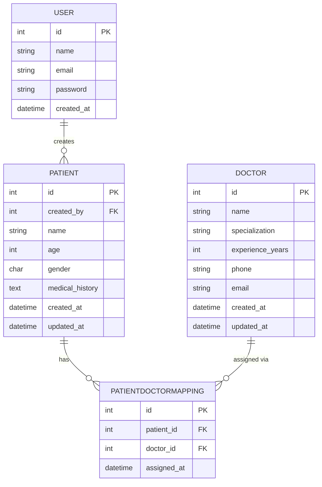
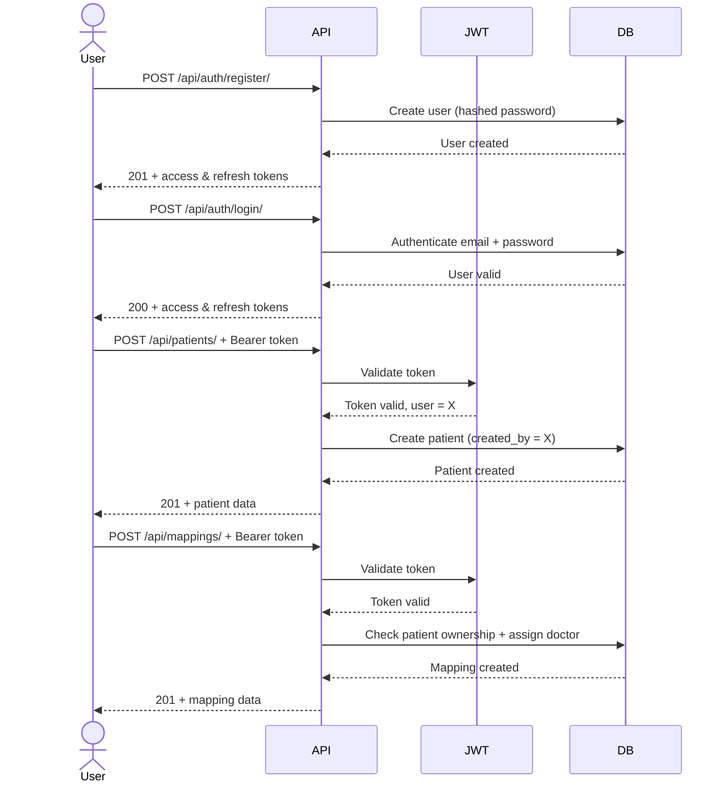

# Healthcare Backend API

A RESTful backend system for managing patients and doctors, built with Django, Django REST Framework, and PostgreSQL.

## Tech Stack
- Python / Django
- Django REST Framework
- PostgreSQL
- JWT Authentication (djangorestframework-simplejwt)

## Setup Instructions

### 1. Clone the repo
git clone <your-repo-url>
cd <project-folder>

### 2. Create and activate virtual environment
python3 -m venv venv
source venv/bin/activate  # Windows: venv\Scripts\activate

### 3. Install dependencies
pip install -r requirements.txt

### 4. Configure environment variables
cp .env.example .env
# Fill in your values in .env

### 5. Set up PostgreSQL
sudo service postgresql start
sudo -u postgres psql < create your DB and user as in .env >

### 6. Run migrations
python manage.py migrate

### 7. Start the server
python manage.py runserver
## Architecture

## Database Schema

## API Flow

## API Endpoints

### Auth
| Method | Endpoint | Description | Auth |
|--------|----------|-------------|------|
| POST | `/api/auth/register/` | Register new user | No |
| POST | `/api/auth/login/` | Login and get JWT | No |

### Patients
| Method | Endpoint | Description | Auth |
|--------|----------|-------------|------|
| POST | `/api/patients/` | Create patient | Yes |
| GET | `/api/patients/` | List own patients | Yes |
| GET | `/api/patients/<id>/` | Get patient detail | Yes |
| PUT | `/api/patients/<id>/` | Update patient | Yes |
| DELETE | `/api/patients/<id>/` | Delete patient | Yes |

### Doctors
| Method | Endpoint | Description | Auth |
|--------|----------|-------------|------|
| POST | `/api/doctors/` | Create doctor | Yes |
| GET | `/api/doctors/` | List all doctors | Yes |
| GET | `/api/doctors/<id>/` | Get doctor detail | Yes |
| PUT | `/api/doctors/<id>/` | Update doctor | Yes |
| DELETE | `/api/doctors/<id>/` | Delete doctor | Yes |

### Mappings
| Method | Endpoint | Description | Auth |
|--------|----------|-------------|------|
| POST | `/api/mappings/` | Assign doctor to patient | Yes |
| GET | `/api/mappings/` | List all mappings | Yes |
| GET | `/api/mappings/patient/<patient_id>/` | Get doctors for a patient | Yes |
| DELETE | `/api/mappings/<id>/` | Remove mapping | Yes |
## Authentication
All protected endpoints require a Bearer token in the header:
Authorization: Bearer <access_token>