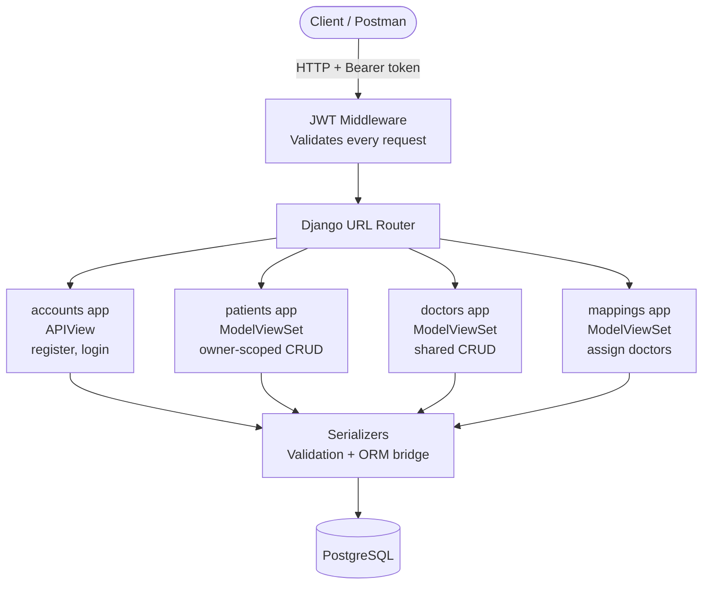
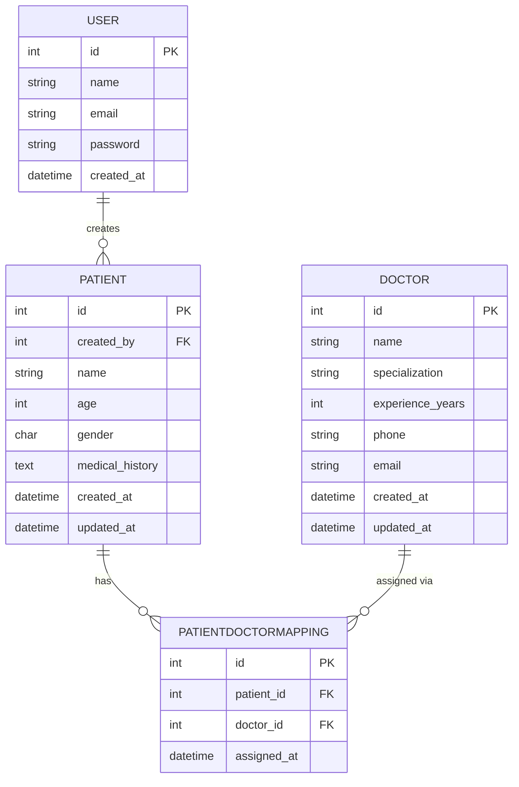
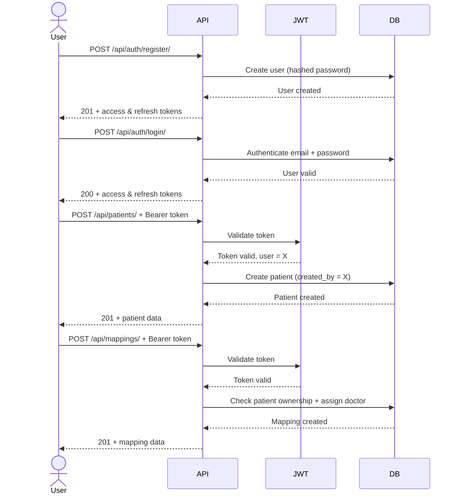

# Healthcare Backend API

A RESTful backend system for managing patients and doctors, built with Django, Django REST Framework, and PostgreSQL.

## Tech Stack
- Python / Django
- Django REST Framework
- PostgreSQL
- JWT Authentication (djangorestframework-simplejwt)

---

## Setup Instructions

### 1. Clone the repo
```bash
git clone <your-repo-url>
cd healthcare_api
```

### 2. Create and activate virtual environment

**macOS/Linux:**
```bash
python3 -m venv venv
source venv/bin/activate
```

**Windows:**
```bash
python -m venv venv
venv\Scripts\activate
```

### 3. Install dependencies
```bash
pip install -r requirements.txt
```

### 4. Configure environment variables
```bash
cp .env.example .env
```
Then open `.env` and fill in your values.

### 5. Set up PostgreSQL
```bash
sudo service postgresql start
sudo -u postgres psql
```
Inside psql, run:
```sql
CREATE DATABASE healthcare_db;
CREATE USER healthcare_user WITH PASSWORD 'yourpassword';
GRANT ALL PRIVILEGES ON DATABASE healthcare_db TO healthcare_user;

-- Required for PostgreSQL 15+
GRANT ALL ON SCHEMA public TO healthcare_user;
ALTER DATABASE healthcare_db OWNER TO healthcare_user;
\q
```
### 6. Run migrations
```bash
python manage.py migrate
```

### 7. Start the server
```bash
python manage.py runserver
```
> Visit `http://localhost:8000/api/health/` to confirm the API is running.
---

## Testing

Import the Postman collection to test all endpoints:

1. Download `healthcare_api.postman_collection.json` from the repo
2. Open Postman → `Ctrl + O` → select the file
3. In Postman, create a new environment with two variables:
   - `base_url` → `http://localhost:8000`
   - `token` → (leave blank)
4. Hit **Register** first → then **Login** — token saves automatically for all requests
---
## Architecture



## Database Schema



## API Flow


## API Endpoints

### Auth
| Method | Endpoint | Description | Auth |
|--------|----------|-------------|------|
| POST | `/api/auth/register/` | Register new user | No |
| POST | `/api/auth/login/` | Login and get JWT | No |

### Patients
| Method | Endpoint | Description | Auth |
|--------|----------|-------------|------|
| POST | `/api/patients/` | Create patient | Yes |
| GET | `/api/patients/` | List own patients | Yes |
| GET | `/api/patients/<id>/` | Get patient detail | Yes |
| PUT | `/api/patients/<id>/` | Update patient | Yes |
| DELETE | `/api/patients/<id>/` | Delete patient | Yes |

### Doctors
| Method | Endpoint | Description | Auth |
|--------|----------|-------------|------|
| POST | `/api/doctors/` | Create doctor | Yes |
| GET | `/api/doctors/` | List all doctors | Yes |
| GET | `/api/doctors/<id>/` | Get doctor detail | Yes |
| PUT | `/api/doctors/<id>/` | Update doctor | Yes |
| DELETE | `/api/doctors/<id>/` | Delete doctor | Yes |

### Mappings
| Method | Endpoint | Description | Auth |
|--------|----------|-------------|------|
| POST | `/api/mappings/` | Assign doctor to patient | Yes |
| GET | `/api/mappings/` | List all mappings | Yes |
| GET | `/api/mappings/patient/<patient_id>/` | Get doctors for a patient | Yes |
| DELETE | `/api/mappings/<id>/` | Remove mapping | Yes |

> **Note:** `GET /api/mappings/patient/<patient_id>/` uses an explicit `patient/` 
> prefix to avoid URL conflicts with `DELETE /api/mappings/<id>/`.

## Authentication
All protected endpoints require a Bearer token in the header:
Authorization: Bearer <access_token>